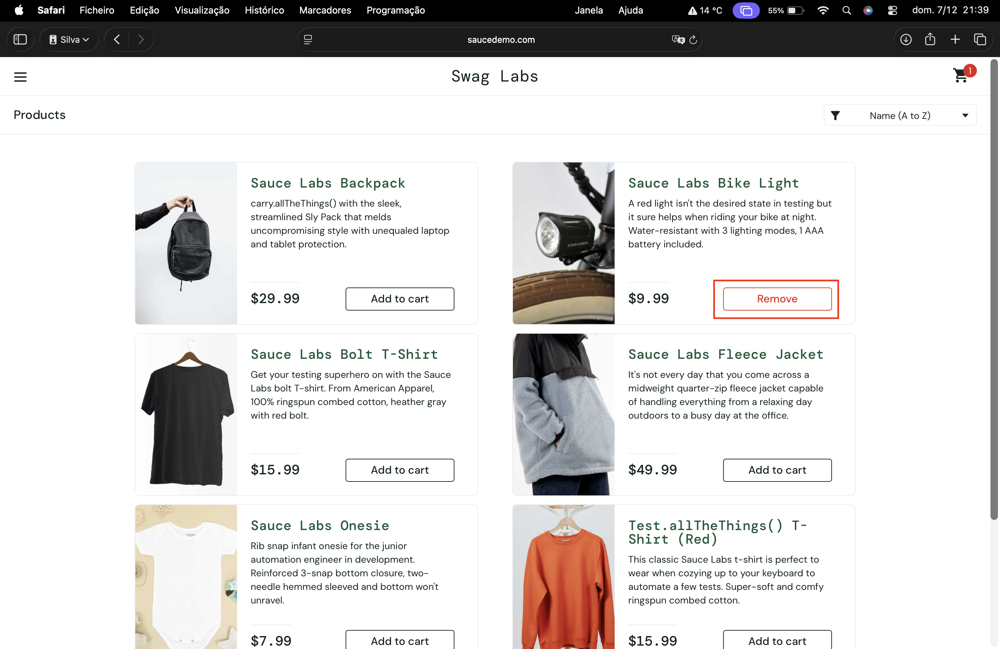
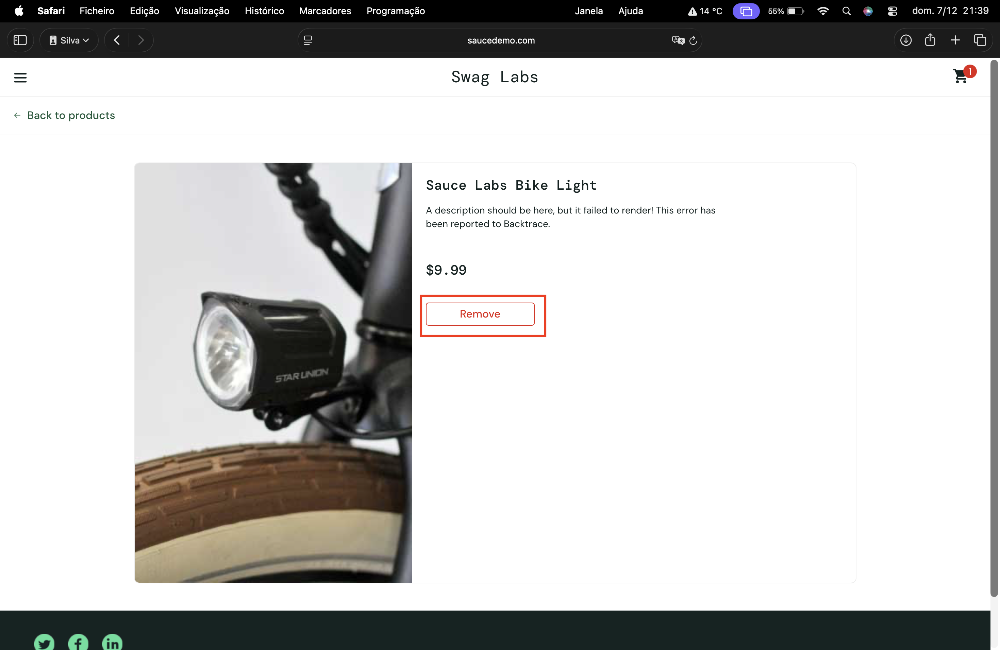

# Remove Button Does Not Remove Product From the Cart in PLP and PDP

## Summary
Clicking the 'Remove' button on both the Product Listing Page (PLP) and Product Details Page (PDP) does not remove the item from the cart, even though the button shows 'Remove'.

---

## Environment
- **Browser:** Safari 26.1 
- **OS:** macOS Tahoe 26.1  
- **Website:** https://www.saucedemo.com
- **Test Account:** error_user

---

## Severity
High

## Priority
Medium

---

## Precondition
User is already logged in with valid credentials.

---

## Steps to Reproduce
1. Navigate to https://www.saucedemo.com.
2. On the Product Listing Page (PLP), add any product to the cart.
3. Click the 'Remove' button for the product on the PLP.
4. Navigate to the Product Details Page (PDP) for the same product.
5. Click the 'Remove' button on the PDP.

---

## Expected Result
The product should be removed from the cart and the button should revert to 'Add to cart'. The cart badge should update accordingly.

---

## Actual Result
Clicking the 'Remove' button does nothing:
- Product remains in the cart.
- Button remains in 'Remove' state.
- Cart badge does not update.

---

## Additional Information
- Issue occurs on both PLP and PDP for all products.
- Reproduces consistently.
- Further cross-browser testing recommended.

---

## Attachments

**Screenshot (PLP):**  

**Screenshot (PDP):**  

**Screen Recording:**  
[View Recording](../screen-records/saucedemo-remove-button.mp4)