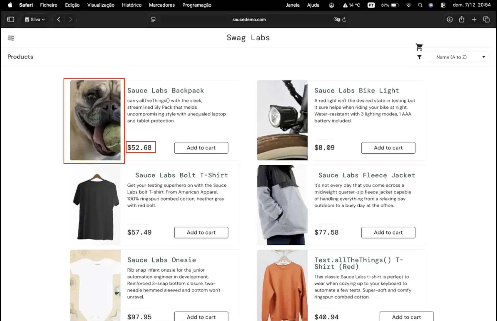
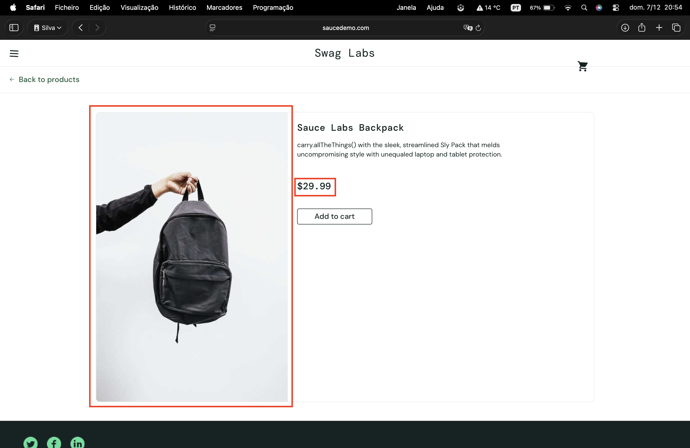

# PLP displays incorrect product image and inconsistent pricing compared to PDP for 'Sauce Labs Backpack'

## Summary  
On the Product Listing Page (PLP), the **“Sauce Labs Backpack”** product displays an incorrect image and a different price compared to the Product Details Page (PDP). This inconsistency may confuse users and affect purchasing decisions.

---

## Environment  
- **Browser:** Safari 26.1 
- **OS:** macOS Tahoe 26.1  
- **Website:** https://www.saucedemo.com
- **Test Account:** visual_user

---

## Severity  
**Major**

## Priority  
**Medium**

---

## Precondition  
User is already logged in with valid credentials.

---

## Steps to Reproduce  
1. Navigate to https://www.saucedemo.com    
2. On the **Product Listing Page (PLP)**, locate the **“Sauce Labs Backpack”** (first product on the left).  
3. Observe the product image and price shown on the PLP.  
4. Click the product to open the **Product Details Page (PDP)**.  
5. Compare the product image and price on the PDP with those shown on the PLP.

---

## Expected Result  
- The PLP should display the **same product image** as shown on the PDP.  
- The price displayed on the PLP should **match exactly** the price shown on the PDP.

---

## Actual Result  
- The PLP displays an **incorrect product image** for “Sauce Labs Backpack.”  
- The **price is different** between the PLP and PDP.  

---

## Additional Information  
- Issue appears isolated to this specific product.  
- Problem reproduces consistently.  
- Cross-browser validation is recommended.

---

## Attachments  
**Screenshot (PLP):**  

**Screenshot (PDP):**  

**Screen Recording:**  
[View Recording](../screen-records/saucedemo-backpack-image-price-issue.mp4)
