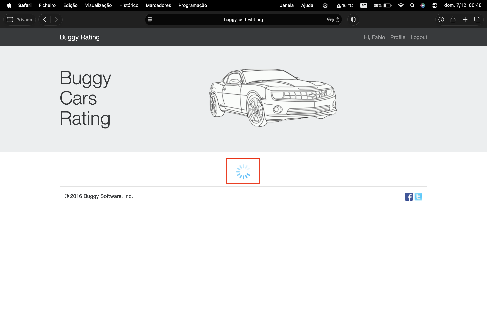

# Clicking Any Car Model Causes the Page to Load Indefinitely

## Summary  
Attempting to open **any car model page** on the Buggy Cars Rating website results in an infinite loading state. The model details page never loads, preventing users from viewing specific model information.

---

## Environment  
- **Browser:** Safari 26.1 
- **OS:** macOS Tahoe 26.1  
- **URL:** https://buggy.justtestit.org/

---

## Severity  
**Major**

## Priority  
**High**

---

## Precondition  
User is on the Buggy Cars Rating homepage.

---

## Note  
This issue occurs when opening **any car model from any category or section**.  
The steps below illustrate **one example path** to reproduce it.

---

## Steps to Reproduce (Example Path)  
1. Navigate to https://buggy.justtestit.org/  
2. Scroll to the **Popular Make** section.  
3. Click on any car make (e.g., Lamborghini).  
4. Select any car model (e.g., *Diablo*).  

---

## Expected Result  
The car model page should load and display the correct model information (description, rating, details, etc.).

---

## Actual Result  
The page enters a **loading state that never completes**.  
No model information is displayed and the browser continues to spin indefinitely.

---

## Additional Information  
- The issue affects **every car model**, regardless of category.  
- Occurs on Safari; additional testing across more browsers recommended.

---

## Attachments  
- **Screenshot:**  
- **Screen Recording:** [View Recording](../screen-records/buggy-cars-model-loading-issue.mp4)